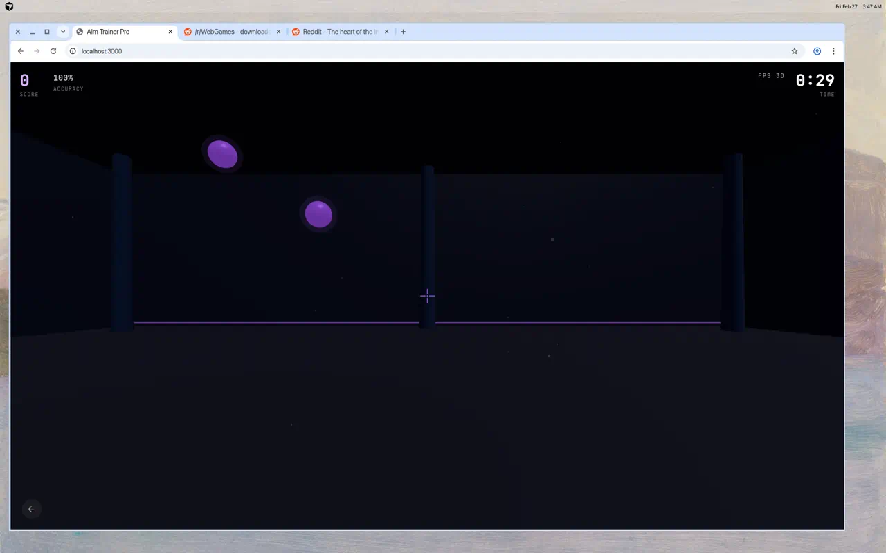
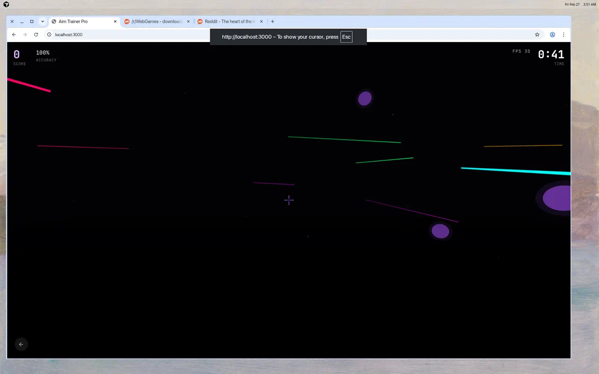
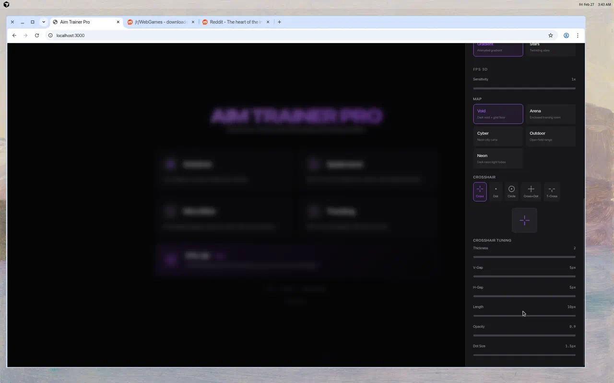
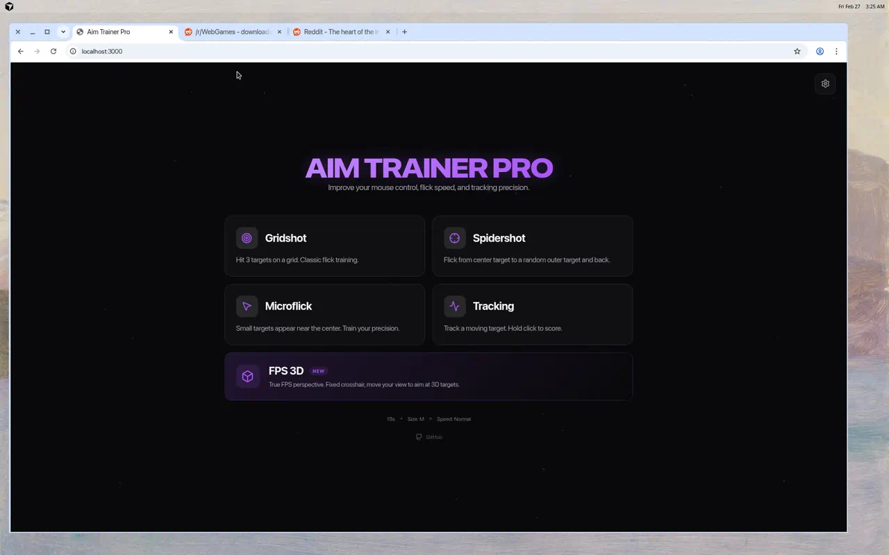
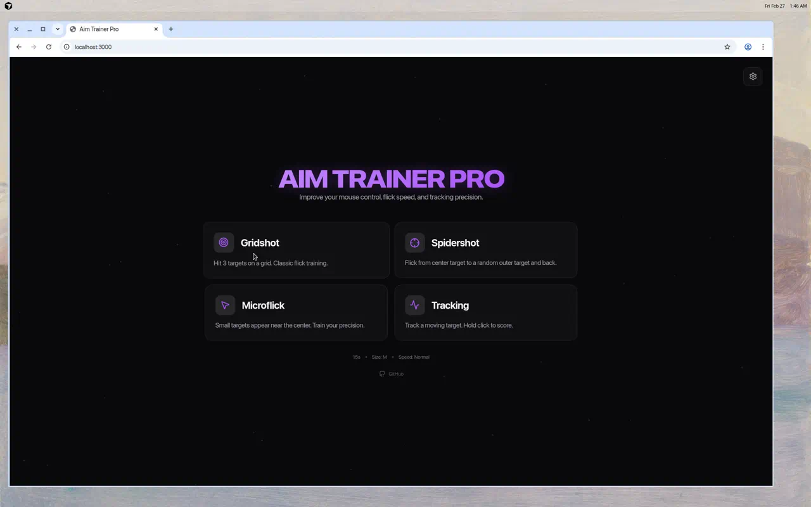

<div align="center">

# 🎯 Aim Trainer Pro

**高性能、高度可定制的网页端鼠标瞄准训练器**

提升你的鼠标控制、甩枪速度和追踪精度。

React + TypeScript + Vite + Three.js + Canvas

[🎮 在线体验](https://aimbot-umber.vercel.app/) · [📦 GitHub](https://github.com/DanZai233/AIMBOT)

</div>

---


## ✨ 功能特性

### 🎮 五种训练模式

| 模式 | 说明 |
|------|------|
| **Gridshot** | 命中网格上出现的 3 个目标，经典甩枪训练 |
| **Spidershot** | 从中心目标甩向随机外围目标再返回 |
| **Microflick** | 小目标出现在屏幕中心附近，训练微调精度 |
| **Tracking** | 追踪移动目标，按住鼠标左键持续得分 |
| **FPS 3D** 🆕 | 真实 FPS 视角，准星固定，移动视角瞄准 3D 空间中的目标 |

### 🕹️ FPS 3D 模式

真正的第一人称射击视角 —— 使用 Three.js + Pointer Lock API，准星锁定在屏幕中心，鼠标移动旋转视角。

**5 张 3D 地图：**

| 地图 | 说明 |
|------|------|
| **虚空 (Void)** | 暗色虚空 + 网格地面 + 漂浮尘埃 |
| **竞技场 (Arena)** | 封闭室内训练场 + 墙壁/天花板/柱子 |
| **赛博 (Cyber)** | 霓虹城市废墟 + 建筑剪影 + 金属地面 |
| **户外 (Outdoor)** | 蓝天绿地 + 远山剪影 + 石柱靶场 |
| **霓虹 (Neon)** | 暗室 + 多彩霓虹光管 + 反射地面 |

<div align="center">
<table>
<tr>
<td></td>
<td></td>
</tr>
<tr>
<td align="center"><b>竞技场 · 封闭室内</b></td>
<td align="center"><b>霓虹 · 多彩光管</b></td>
</tr>
</table>
</div>

**准星自定义：**

- 5 种样式：十字 / 圆点 / 圆环 / 十字+点 / T 形
- 6 项微调：粗细 / 上下间距 / 左右间距 / 线长 / 不透明度 / 中心点大小
- 灵敏度：0.1x ~ 5.0x 可调
- 设置面板内实时预览



### ⚙️ 丰富的配置项

通过右侧滑出设置面板，自由调整游戏参数：

- **训练时间**：15 / 30 / 60 / 120 秒
- **目标大小**：小 / 中 / 大
- **目标速度**：慢速 / 正常 / 快速


### 🎨 个性化定制（2D 模式）

- **目标形状**：圆形 / 菱形 / 星形 / 六边形 / 三角形
- **光标样式**：十字线 / 圆点 / 圆环 / 精确十字（CSS SVG 零延迟）
- **主题配色**：青 / 红 / 绿 / 紫 / 橙（5 种配色方案）
- **背景主题**：暗黑 / 网格 / 渐变 / 星空

<div align="center">
<table>
<tr>
<td></td>
<td></td>
</tr>
<tr>
<td align="center"><b>青色 · 圆形 · 暗黑背景</b></td>
<td align="center"><b>紫色 · 星形 · 星空背景</b></td>
</tr>
</table>
</div>

### 🌐 多语言支持

中文 / English 一键切换，所有界面文本实时翻译。

<div align="center">
<table>
<tr>
<td></td>
<td></td>
</tr>
<tr>
<td align="center"><b>中文 · FPS 3D 模式</b></td>
<td align="center"><b>English · 完整翻译</b></td>
</tr>
</table>
</div>

### 📊 详细的成绩统计

- 等级评定（S / A / B / C / D）
- 最终得分、精准度、命中/失误
- 数字递增动画效果


### ⚡ 性能优化

- **零延迟光标**：CSS SVG 自定义光标，由操作系统原生渲染
- **DPI 感知**：适配 Retina 高分屏
- **轻量渲染**：高效发光方案替代 `shadowBlur`
- **60fps 流畅**：优化的 Canvas / WebGL 渲染管线

### 🎬 动效细节

- 主菜单粒子连线背景动画
- 目标弹性缩放 + 命中粒子爆炸 + 得分弹出
- 失误红色闪光 + 设置面板平滑动画
- 所有设置自动保存到 `localStorage`

## 🚀 快速开始

**前置要求**：Node.js 18+

```bash
# 克隆项目
git clone https://github.com/DanZai233/AIMBOT.git
cd AIMBOT

# 安装依赖
npm install

# 启动开发服务器
npm run dev
```

打开浏览器访问 http://localhost:3000

或直接体验在线版：**https://aimbot-umber.vercel.app/**

## 📦 可用命令

| 命令 | 说明 |
|------|------|
| `npm run dev` | 启动开发服务器（端口 3000） |
| `npm run build` | 构建生产版本到 `dist/` |
| `npm run preview` | 预览生产构建 |
| `npm run lint` | TypeScript 类型检查 |
| `npm run clean` | 清理构建产物 |

## 🛠️ 技术栈

| 技术 | 用途 |
|------|------|
| **React 19** | UI 框架 |
| **TypeScript** | 类型安全 |
| **Vite 6** | 构建工具 + 开发服务器 |
| **Three.js** | 3D 渲染引擎（FPS 模式） |
| **HTML5 Canvas** | 2D 游戏渲染引擎 |
| **Tailwind CSS v4** | 样式系统 |
| **Motion** | React 组件动画 |
| **Lucide React** | 图标库 |

## 📁 项目结构

```
src/
├── main.tsx                  # 应用入口
├── App.tsx                   # 根组件（状态机：菜单 → 游戏 → 结果）
├── types.ts                  # 类型定义 + 配置常量
├── i18n.ts                   # 中英文翻译模块
├── index.css                 # Tailwind 导入 + 全局样式
├── lib/
│   ├── GameEngine.ts         # 2D Canvas 游戏引擎
│   └── FPS3DEngine.ts        # 3D Three.js 游戏引擎
└── components/
    ├── MainMenu.tsx           # 模式选择 + 粒子背景
    ├── GameScreen.tsx         # 2D 游戏画面 + HUD
    ├── FPS3DScreen.tsx        # 3D FPS 游戏画面 + 准星
    ├── ResultsScreen.tsx      # 成绩统计 + 等级评定
    └── SettingsPanel.tsx      # 设置面板（抽屉式）
```

## ⭐ Star

如果觉得这个项目对你有帮助，欢迎给个 Star 支持一下！

## 📄 License

MIT
